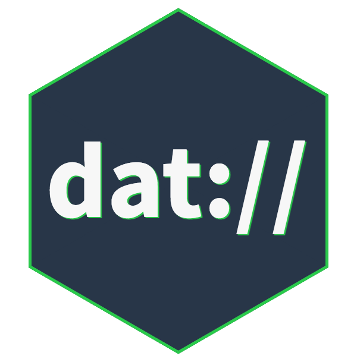

# Dat

> npm install -g dat

Use Dat command line to share files with version control, back up data to servers, browse remote files on demand, and automate long-term data preservation.

[][Dat Project]

Have questions? Join our chat via IRC or Gitter:

[![#dat IRC channel on freenode][irc-badge]][irc-channel]
[![datproject/discussions][gitter-badge]][gitter-chat]

### [Read the Docs](https://docs.datproject.org/docs/cli-intro)

---

Mac/Linux      | Windows      | Version
-------------- | ------------ | ------------
[![Travis][travis-badge]][travis-build] | [![Build status][appveyor-badge]][appveyor-build] | [![NPM version][npm-badge]][npm-package]

Have questions or need some guidance?
You can [chat with us](http://chat.datproject.org) in IRC on [#dat][irc-channel] or [Gitter][gitter-chat]!

## For Developers

Please see [guidelines on contributing] before submitting an issue or PR.

This command line library uses [dat-node] to create and manage the archives and networking.
If you'd like to build your own Dat application that is compatible with this command line tool, we suggest using dat-node.

### Installing from source

Clone this repository and in a terminal inside of the folder you cloned run this command:

```
npm link
```

This should add a `dat` command line command to your PATH.
Now you can run the `dat` command to try it out.

The contribution guide also has more tips on our [development workflow].

* `npm run test` to run tests
* `npm run auth-server` to run a local auth server for testing

## License

BSD-3-Clause

[Dat Project]: https://datproject.org
[Code for Science & Society]: https://codeforscience.org
[Dat white paper]: https://github.com/datproject/docs/blob/master/papers/dat-paper.pdf
[Dat Desktop]: https://docs.datproject.org/install#desktop-application
[Beaker Browser]: https://beakerbrowser.com
[registry server]: https://github.com/datproject/datbase
[share-gif]: https://raw.githubusercontent.com/datproject/docs/master/assets/cli-share.gif
[clone-gif]: https://raw.githubusercontent.com/datproject/docs/master/assets/cli-clone.gif
[Knight Foundation grant]: https://blog.datproject.org/2016/02/01/announcing-publicbits-org/
[dat-node]: https://github.com/datproject/dat-node
[dat-ignore]: https://github.com/joehand/dat-ignore
[new-issue]: https://github.com/datproject/dat/issues/new
[dat#503]: https://github.com/datproject/dat/issues/503
[install-node]: https://nodejs.org/en/download/
[install-node-npm]: https://docs.npmjs.com/getting-started/installing-node
[fixing-npm-permissions]: https://docs.npmjs.com/getting-started/fixing-npm-permissions
[guidelines on contributing]: https://github.com/datproject/dat/blob/master/CONTRIBUTING.md
[development workflow]: https://github.com/datproject/dat/blob/master/CONTRIBUTING.md#development-workflow
[travis-badge]: https://travis-ci.org/datproject/dat.svg?branch=master
[travis-build]: https://travis-ci.org/datproject/dat
[appveyor-badge]: https://ci.appveyor.com/api/projects/status/github/datproject/dat?branch=master&svg=true
[appveyor-build]: https://ci.appveyor.com/project/joehand/dat/branch/master
[npm-badge]: https://img.shields.io/npm/v/dat.svg
[npm-package]: https://npmjs.org/package/dat
[irc-badge]: https://img.shields.io/badge/irc%20channel-%23dat%20on%20freenode-blue.svg
[irc-channel]: https://webchat.freenode.net/?channels=dat
[gitter-badge]: https://badges.gitter.im/Join%20Chat.svg
[gitter-chat]: https://gitter.im/datproject/discussions
