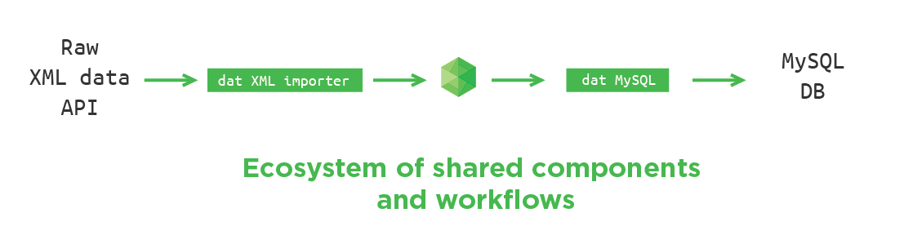

# Importing data

The main goal of dat is to enable an ecosystem of streaming read/write interfaces between all conceivable data sources.



The problem lies in that there are thousands and thousands of different file formats, databases and APIs so there cannot be one generalized approach to sync them all. For this reason dat is designed with a small core philosophy: to only provide enough of a generalized API to synchronize data and to leave the actual use-case specific parsing up to a third party ecosystem.

There are a few different ways to store data in dat, the best one depends on your use case: the type of data, it's update frequency, format, structure, etc.

## Storage options

Dat has a tabular store that's good for mutable data and a blob store that's better for immutable data. Mutable in this case means essentially a database table in which you will be looking up and updating data. Immutable means larger files (bigger than ~100KB per object) e.g. photos, videos or other non-tabular binary files.

### Tabular store

The default tabular store in dat is [LevelDB](http://leveldb.org/), which is a low-level database building block that handles streaming many small keys and values to and from disk. 

If your data is tabular in nature, e.g. it has rows made of up individual cells such as an Excel file, CSV, MySQL table or time-series data then you can store it in the tabular store. Dat can import CSV, JSON or [Protocol Buffers](https://code.google.com/p/protobuf/) data. 

Rows stored in the tabular store must have a `key` and `version`. If you don't specify these then they will be created for you. For example, if you import this CSV file into dat:

```
name,age
Carl,5
Maria,3
David,8
```

Then dat will add `key` and `version` columns as well and store something like this (simplified for this example):

```
key,version,name,age
1,1,Carl,5
2,1,Maria,3
3,1,David,8
```

At import time you can also tell dat to use a specific column as the `key`, but only if that key is unique, otherwise you will get conflict errors when you import. If we had imported the above CSV and told dat to use the `name` column as the `key` then dat would store something like this instead:

```
key,version,name,age
Carl,1,Carl,5
Maria,1,Maria,3
David,1,David,8
```

Choosing a `key` is important, as you can only look things up by key! In a future version of dat we will provide a way to index other columns, but for now `key` is the only column you can query against.

When a row is updated it gets a new version number. For example if we changed Maria's age to 4 then the internal dat store would now have something like this:

```
key,version,name,age
Carl,1,Carl,5
Maria,1,Maria,3
Maria,2,Maria,4
David,1,David,8
```

Most of the time when you read data out of dat you only get the most recent version of every `key`, but you can also access older versions if you use special APIs.

### Blob store

If you have data that doesn't necessarily fit in a "cell", then you can attach [blobs](http://en.wikipedia.org/wiki/Binary_large_object) to existing rows.

Whereas keys and values in the tabular store must be small enough to fit in memory, the blob storage API is exposed as a read/write stream. Blobs are 'attached' to rows, so if you had a dat with 1 row of data in it:

```
key,version
foo,1
```

And you attached a file called 'image.png' to `foo`, then the tabular store would get updated to something like:

```
key,version,blobs
foo,2,{"image.png":{"hash":"de280859604b6141ac9afd1116b484ed4e51f52a220ac98de1f795645a195ac7","size":1385181}}
```

(Notice that the row is now at version 2)

The data of `image.png` is not stored inside the tabular store -- only the metadata is. The image data itself is stored elsewhere, e.g. on the filesystem directly.

During replication dat will transfer all data from both the tabular store as well as all blobs.

## Import methods

### Importing datasets using the dat APIs

To import a dataset into dat you can use the [dat CLI API](https://github.com/maxogden/dat/blob/master/docs/cli-usage.md), [dat JS API](https://github.com/maxogden/dat/blob/master/docs/js-api.md) or the [dat REST API](https://github.com/maxogden/dat/blob/master/docs/rest-api.md)

On the command line you can easily import newline-delimited JSON (one JSON object per line) or CSV into dat.

#### Data Importer Modules

These are special types of modules that one can automatically use to run data import jobs.

You can use the `dat.json` config file to [transform data](https://github.com/maxogden/dat/blob/master/docs/dat-json-config.md#transformations) or register automatic data import scripts using [hooks](https://github.com/maxogden/dat/blob/master/docs/dat-json-config.md#hooks). 

Some example importer modules that can be used with dat hooks:

- https://github.com/mafintosh/dat-npm
- https://github.com/maxogden/dat-geomagnetic

### LevelDOWN

LevelDB has an [pluggable backend API](https://github.com/rvagg/abstract-leveldown#abstract-leveldown-) that has been used to create [various backends](https://github.com/rvagg/node-levelup/wiki/Modules#storage), which means that dat can run on top of any LevelDOWN compatible backend.

The default backend is the original LevelDB C++ library by Google (used from Node.js via the [LevelDOWN](https://github.com/rvagg/node-leveldown) bindings). If you want to store data in a tabular database other than LevelDB you can do so by writing a LevelDOWN adapter for it! The main requirements for a LevelDOWN backend are:

- Ability to sort data lexicographically by key
- Ability to iterate through the sorted data by key in forwards and reverse sorted order

### Blob stores

Depending on the constraints of the host system and the size of the dataset it may not be possible to import blobs into dat (since blobs are copied during import).

Instead you can use dat to index blobs, meaning only metadata will be stored in dat but the original blob data will not be copied into the dat blob store.

The downside of this approach is that blobs cannot be versioned, as only the current version of the blob will be available since dat is not storing old versions of it.

We have developed the [abstract-blob-store](https://github.com/maxogden/abstract-blob-store) API to help standardize how storage backends are exposed to dat.

Check out the `abstract-blob-store` readme for examples of existing blob store backends.

### Replicators

Dat has a replication protocol that can be implemented to allow for some data store to be compatible with `dat clone`, `dat pull` or `dat push`. In the dat codebase we use the [dat-replication-protocol](https://github.com/mafintosh/dat-replication-protocol) module and the higher level [dat-replicator](https://github.com/mafintosh/dat-replicator) module to implement replication between two dat instances, but dat can also replicate with other sources that speak the same protocol.

We have some documentation on [how dat replication works](https://github.com/maxogden/dat/blob/master/docs/replication.md).
