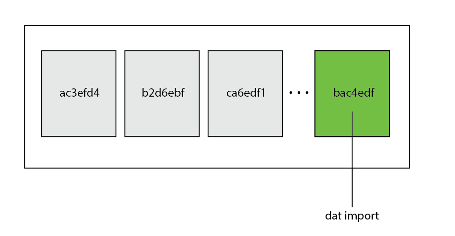
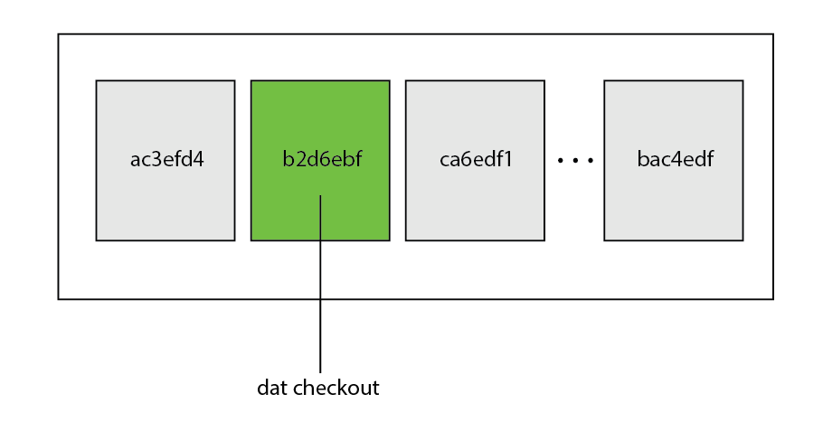
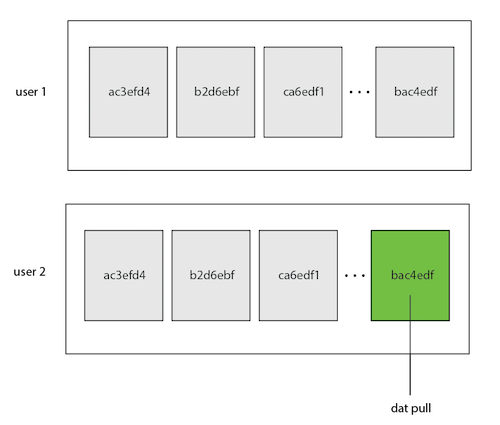
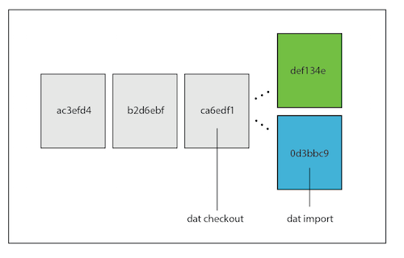
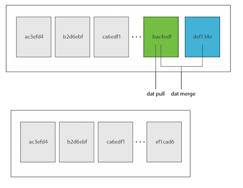

# dat

From a variety of contributors.

http://dat-data.com

http://github.com/maxogden/dat

**DRAFT DRAFT this is a DRAFT DRAFT**

## Abstract

The broad adoption of computers in scientific research has made it possible to study phenomenon at an unprecedented scale. Researchers are now able to store and analyze disparate datasets that would have otherwise been impossible or very time-consuming to collect. Scientific peers, however, often have difficulty accessing the source data used during the scientific process, and existing version control systems like Git hit their limit with large, streaming, or complex data pipelines. In this paper, we outline the user interface and architecture for **dat**, a version-controlled, distributed data tool designed to improve collaboration between data systems and the people who use them. The design decisions described in this article are motivated by real-world use cases developed in collaboration with colleagues in the scientific community. This paper serves as a living document to help data scientists and developers understand use cases and extend the core technology. Send a pull request!

## 1. Introduction

Often, data must undergo the painful process of "munging," where the heterogeneity of various sources are integrated together to form source dataset(s). Although data collection and storage across all scientific disciplines has increased substantially, reproducibility of computational analysis still remains primitive. For example, most studies depend on data sources that are stored in a variety of incompatible formats. Researchers persistently transform this data for analyses, building an (often collaborative) workflow to ensure interpretation of accurate data. However, it is often difficult to keep track of forks in the datastream, resulting in increasing interconnectedness and complexity of source data. In other words, analyses that result in significant, irreconcilable transformations increase data heterogeneity, and thus headache for a team.

A sustainable and scalable collaborative workflow, also known as a data pipeline, is built to ensure correctness during this kind of collaborative work. Unfortunately, building this infrastructure is difficult, expensive, and time-consuming, especially for domain experts. This means that data-intensive research is often limited to those with the necessary computational skills, personal and professional connections, or institutional resources to build, maintain, and ensure reproducibility of a complex data pipelining system. This *data divide* explicitly "demarcates research 'insiders' and 'outsiders'... undermin[ing] the research community" [1]. If only the original authors are able to reproduce scientific discoveries, the scientific process is broken.

To close the data divide, we must build tools that allow researchers to be able to focus more on scientific discovery and less on integrating disparate data. We introduce Dat, a version-controlled distributed database and data tool that has the user interface of a version control system (VCS) for tabular and binary data. Key features of dat include the ability to *track changes* in tabular and binary formats; *supply access points* across peer-to-peer internal and public networks; *create historical checkpoints* with metadata; *replicate* quickly at a given checkpoint; and *encourage forking* of data streams.

## 2. Related Work

There are a variety of ad-hoc systems that enable interactions that dat is designed to support, but often they involve proprietary software or do not ensure correctness. Many people use on-disk formats like csv or excel to store and transfer their data to other people. However, these formats are poor for more complicated use cases, such as merging disparate datasets. Kafka may be the closest analogous database, designed by LinkedIn in 2011 for distributed message processing for enterprise logs, such as clickstream or activity feed data [2]. Like Kafka, dat is well-suited for storing, transferring, and merging large amounts of data between incompatible data systems. However, Kafka lacks key interface design for collaboration across teams of varying computational expertise. By contrast, we designed dat to be used easily by data scientists of varying skillsets. We also designed it to work well with git in order to integrate data versioning with existing code versioning pipelines.

We also wanted to build a system that can easily distribute public data over common protocols, like http and ssh. For example, those who sit at the nexus of software development and data production -- librarians, scientists, government agencies, etc. -- have started using online portals like Socrata [3], Harvard's dataverse [4], figshare [5], and others for distributing datasets. However, these data distribution methods post raw data as read-only, without ways to track and compare versions, retrace errors, explore new approaches in a structured manner, or contribute changes upstream. Furthermore, these data portals do not support versioning tabular data at the row-level, which can make it difficult to maintain a full audit trail. We maintain that version-controlled systems are key to not just code, but also data -- the data gets better as more people interact with it, because they enable collaboration between data producers, data engineers, data managers, and data scientists.

Researchers are using VCS for data; however, most of these tools were designed to work well for teams of developers, not teams of researchers. VCS like git provide "a lightweight yet robust framework that is ideal for managing the full suite of research outputs such as datasets, statistical code, figures, lab notes, and manuscripts" [6]. However, because Git was designed to track changes to relatively small text files, many datasets, especially those that change often, are cumbersome to use with Git. Two years ago, Facebook created a test Git repository to explore its limits, and found that at 1.3 million files with 15 GB of data, Git takes upwards of 40 minutes to respond to a simple command [7]. To fix this performance problem with Git, there is an extension called the 'Git Large File Storage (LFS)' released in 2015 [8], and Git-Annex [9], written in Haskell. We believe these extensions are not designed well for data science use cases, which often require support for features such as versioning at the row-level, real-time data feeds, partial replication or parallel downloading. While Git has revolutionized the way that open source code is written for the software development world, workflows around collaborating on data in the research world still remain primitive.

## 3. Design of dat

Dat was designed with the help of our advisors and pilot projects in academia. We prototyped two key case studies to see what it would look like to use dat in a complex data processing pipeline. See these case studies in Section 4.

### 3.1 Importing Datasets
All data is compressed and stored in the `data.dat` folder on disk. Values can be defined as binary (i.e., protobufs via `write`) or tabular (csv, tsv, newline-delimited json formats via `import`).

When data is imported into dat, it must be put into a dataset. To support bifurcated schemas, we encourage users to create multiple datasets, so that each schema will be independent. A dataset is analogous to a sql table or a nosql collection; however, we chose not to use the language of 'table' or 'collection' because dat datasets do not support robust querying at this time. Each dataset is compartmentalized so that tabular datasets with different schemas can be stored in the same repository without collision. In other words, rows define the schema for a given dataset, and there can be multiple datasets in a single dat.

Here, we create a new dataset called 'cities' and import some tabular data. To update data later, we must provide a key that identifies each row in the dataset. In this example, the `cityId` column is a unique identifier for each row. Dat will auto-generate keys if the user supplies `--key=false` upon import.

```
$ cat cities.json
cityId, name, region, country
12389720, Portland, Oregon, USA
41031233, San Francisco, California, USA
35682579, Copenhagen, Hovedstaden, Denmark
...

$ dat import cities.json -d cities -m "Added cities dataset" -k cityId
Added 302,143 keys (32.03 Mb, 4.4 Mb/s).
Data imported successfully.
Current version is now 7b13de1bd942a0cbfc2721d9e0b9a4fa5a076517
```

Blob data can be written just like tabular data using `dat write`. Blob data and tabular data are kept separate inside of each dataset -- tabular data is written to leveldb while binary data is written to a content addressable blob object store. Each of these are modular and can be replaced with S3, SQL-variants, and other backends.

### 3.2 Versioning

When dat begins writing to disk, a new `version` is created -- a uniquely identifiable sha256 hash that represents the changes that were made during the operation. As each write or import operation is performed, dat creates a new version hash that identifies the entire dat, not just the dataset that was changed.



Human-readable messages can also be attached to a new version. A user can perform a `dat log` to get access to the history of the dat.

```
$ dat log
Version: 6bdd624ae6f9ddb96069e04fc030c6e964e77ac7 [+12, -0]
Date:    April 15th 2015, 7:30PM PST

  Added new cities dataset.

Version: 7b13de1bd942a0cbfc2721d9e0b9a4fa5a076517 [+302,143, -0]
Date:   April 15th, 2015, 7:29PM PST
```

To go back in time, a user can `dat checkout` for a non-destructive rollback to a version in the past. Data is never deleted from dat -- only different views of the data are made accessible given a particular version.



### 3.3 Replication

A user can replicate data from another user using typical transport protocols such as http or ssh. Dat is transport agnostic, so it is well suited for deployment on various kinds of systems with little IT overhead. When the repository is pulled from another user, all metadata and changes are replicated exactly as they appear on the peer's disk. Versions are transmitted exactly as represented locally over the transport protocol, and the history never changes. This means that once a version is created, it can be referenced to refer to the same data across all peers (unless purged).

When a peer makes a change (write/import), a new version is created which is then immediately available for peers to pull. When using `dat pull`, dat will only fetch the newest changes in the repository for fast replication.



### 3.4: One thousand forks when all you need is a knife isn't irony

After checking out a dataset to a previous point in the past, a user can still add more data. However, adding to a version that is not the latest creates a new fork in the dataset.

Although forks could be represented as conflicts to be merged immediately (as one might expect in a version control system such as Git), dat's philosophy is the opposite. We think that data tools should embrace forks as key support for experimentation during the scientific process. When a user pulls from a peer, forks will also be pulled so that each user has a complete picture of the graph.




Forks can be merged into a single, new commit to create a new version hash. The `dat merge <version>` operation accepts a stream of resolved values in the same format they are emitted in `dat diff`. See the dat repository for more examples on merging.



## 4. Ecosystem

To test dat’s capability to work with large datasets, we worked with Demitri Muna of Ohio State University, and data analyst and programmer Yuhong Wang, to build a system for importing and indexing the 400 GB Wide-field Infrared Survey Explorer (WISE) dataset from NASA/Caltech, which includes data on over 600 million stars [10]. The major goal for us was to use dat to build a single catalog of raw data files for multiple data sources—one metadata catalog for multiple sky-scan datasets. A secondary goal was to help automate the data import pipeline to make it easy to get installed for users who might want to load data into Trillian. In its raw form, much of the data is scattered across different websites and offer several download procedures.  With Dat's large file capabilities, we were able to perform lazy aggregation on disparate chunks of links, effectively shielding the end user of the database from the complexities of source management and organization.

In our second project, Bruno Vieira of Queen Mary University London worked with us directly to build versioning and data acquisition into Bionode. Bionode is a collection of open source, command-line tools for creating streaming bioinformatics pipelines with Node.js. Vieira has written about how brittle that bioinformatics APIs can be [11], which makes reproducibility very difficult. The main thing the Dat team took away from this project was the importance of not only offering a data versioning and acquisition system, but also making sure we integrate tightly with existing tools that researchers are using to analyze and process their data.

### Client libraries

We have two currently officially supported client libraries in [R, developed by ropensci](https://github.com/ropensci/rdat) and [python](https://github.com/karissa/datpy). We are actively accepting contributors -- reach out to us!

### Pipelines

We have written a commandline tool and module called [gasket](https://github.com/datproject/gasket) that allows users to write preconfigured pipelines. This is useful for building data pipelines, although it is still experimental and has not been tested in production. Contributions welcome.

## 5. Architecture

We architected dat as a variety of open source modules that build upon and integrate with each other, encouraging contribution from an existing community of data engineers. See the full list of modules used in the [package.json](../package.json)

### 5.1 It's a stream!

All data in dat is read and written as **streams**. That means that a computer running dat does not have to hold the entire dataset, or even an entire row, in memory at any one time. There are significant advantages to this method over popular solutions like Git.

  1. Large data replications can be stopped at any time without corrupting on-disk representation of the data. This is ideal for looking at small subsets of data quickly before retrieving a potentially large dataset.

  2. Streaming real-time data can be connected to a dat endpoint, allowing for evented pipeline I/O between heterogeneous components.

  3. Data can be retrieved in pieces, allowing replication support from bittorrent swarms.

### 5.2  It's a log!

All data in dat is immutable. That means that all data is treated like a log of a particular event, and only the view of the data overwritten when new data is added.

### 5.3 It's a graph!

Whatever you write to dat is appended to the graph as a new node. Each node knows which version it came from, i.e., its parent node.

For example, this series of commands produces the following forked graph:

```
dat import a.csv
<a>
dat import b.csv
<b>
dat import c.csv
<c>
dat checkout <b>
dat import d.csv

----

a
|
b
| \
c  d
```

This is a graph with a fork in it, a common occurrence in a dat repository. This forked repository will then have two **layers**. A new layer is created in one of two ways. The first is when a new dataset is created. The second is when new data is imported as a child node, and the parent is not the head of the graph -- in other words, when new data is added to a historical checkout of an existing dataset.

```
a (key: foo, value: bar) (create new layer, layer-id => graph-node-id (version-id))
|
b (key: baz, value: foo) (lookup a's layer, if head insert in that layer, if not head create new layer)
|
c (key: foo, value: baz) (...)
```

See more on implementation details in the [dat-core](https://github.com/maxogden/dat-core) documentation.

## 6. Conclusion and Final Remarks
We hope data tools like dat will be key in the evolution towards data pipelines that are open, thus more accessible; documented, thus more reproducible; and challengeable, thus more correct.

# Bibliography
  1. Boyd, Danah, and Kate Crawford. "Critical questions for big data: Provocations for a cultural, technological, and scholarly phenomenon." Information, communication & society 15.5 (2012): 662-679.
  2. Kreps, Jay, Neha Narkhede, and Jun Rao. "Kafka: A distributed messaging system for log processing." Proceedings of 6th International Workshop on Networking Meets Databases (NetDB), Athens, Greece. 2011.
  3. Erickson, John S., Amar Viswanathan, Joshua Shinavier, Yongmei Shi, and James A. Hendler, "Open Government Data: A Data Analytics Approach," IEEE Intelligent Systems, vol. 28, no. 5, pp. 19-23, Sept.-Oct., 2013
  4. King, Gary. "An introduction to the Dataverse Network as an infrastructure for data sharing." Sociological Methods & Research 36.2 (2007): 173-199.
  5. Figshare. Accessed June 1, 2015. <http://figshare.com/>
  6. Ram, Karthik. Source Code for Biology and Medicine 2013, 8:7 <http://www.scfbm.org/content/8/1/7>
  7. Redstone, Joshua. "Git performance results on a large repository." gamne.comp.version-control.git. June 1, 2015. <http://thread.gmane.org/gmane.comp.version-control.git/189776>
  8. Github. "Announcing Git Large File Storage System." June 1, 2015. <https://github.com/blog/1986-announcing-git-large-file-storage-lfs>
  9. Lührig, Jan Philipp. "File synchroniszation using git-annex assistant." 2013. <https://media.itm.uni-luebeck.de/teaching/ws2013/sem-cloud-computing/File_synchronization_using_git-annex_assistant.pdf>
  10. Wang, Yuhong. “dat-wise: Importer for the WISE All-Sky Data Products,” Github. January 19th, 2015. <https://github.com/ywyw/dat-wise>
  11. Vieira, Bruno. "When Bioinformatics APIs break". Medium. June 1, 2015. <https://medium.com/@bmpvieira/when-bioinformatics-apis-break-821ae9919492>
