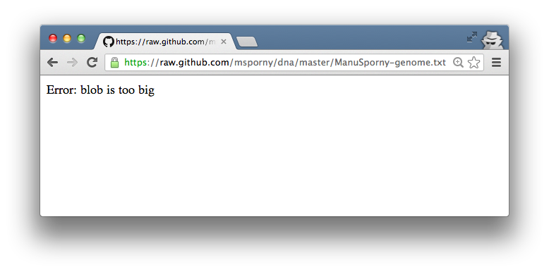

# dat

[](https://nodei.co/npm/dat/)
[](https://travis-ci.org/maxogden/dat)

## collaborative data

`dat` is currently pre-alpha. You can test it out or hack on it now, but all things are subject to change.

To learn more about `dat` please read [what is `dat`?](#what-is-dat).

# Hacking on dat

If you are interested in testing out the pre-alpha version of `dat` you can install it using `npm` (which usually gets installed when you [install `node`](http://nodejs.org/))

`dat` is primarily intended as a command line tool. There is also a programmatic API that you can use in node.js programs for more advanced use cases, as well as a way to have `dat` call programs written in other programming languages to transform data.

## Install

To get the currently published version (recommended):

```
npm install dat -g
```

The `-g` means "install globally" which makes the `dat` command available in your command line path.

You can also install the latest development version with `git`:

```
git clone git://github.com/maxogden/dat.git
cd dat
npm install
npm link
```

### How to use `dat`

See [usage.md](usage.md) for usage, or type `dat help`.

### What is `dat`?

`dat` is a project that seeks providing better tools for data collaboration:

- make data **syncable**. automatic sync and updates of entire data sets (or subsets)
- data sets can be very large (billions of items) or updated frequently (real time data)
- sync and transformation plugin API to connect `dat` to any existing database/format/language
- built with automated + decentralized workflows in mind

To illustrate the goals of `dat` consider the GitHub project, which is a great model of this idea working in a different space. GitHub is built on top of an open source tool called `git` and provides a user-friendly web application that lets software developers find code written by others, use it in their own programs and improve upon it. In a similar fashion `dat` will be developed as a set of tools to store, synchronize, manipulate and collaborate in a decentralized fashion on sets of data, hopefully enabling platforms analogous to GitHub to be built on top of it.

The initial prototype of `dat` will be developed thanks to support from the Knight Foundation  as a collection of open source projects. Full time work began in August 2013 by [Max Ogden](http://maxogden.com/gut-hosted-open-data-filets.html) and other open source contributors. The initial grant supports 6 months of full time work.

#### Project components

1. **command line tool**: capable of data storage, sync and running transformations
2. **transformation modules**: simple scripts written in any language that can clean up/enhance/convert data, e.g. geocoding, converting from one date format to another
3. **sync modules**: plugins (e.g. `dat-postgres`, `dat-excel`, `dat-xml`) that hook `dat` data streams up to different databases and formats and vice versa

See ['how `dat` works'](#how-dat-works) below for technical descriptions. The transformation and sync modules are where `dat` really shines in that they define a way for data tools and scripts to talk to each other so that these components can be made generic and shared.

[](https://jlord.s3.amazonaws.com/dat-diagram.png)

### Get involved with `dat`

- Watch `dat` repo on Github
- Install and test the alpha version of `dat`. Leave feedback in the Github Issues of this repository!
- Are you a coder? Pick your favorite database/API/file format and try to implement [SLEEP](http://dataprotocols.org/sleep/) on it. `dat` will be able to consume SLEEP (though both may evolve).
- Suggest an organization that should be using `dat` to distribute their data. Let me know [on Twitter](http://twitter.com/maxogden).
- Have any other questions/concerns? [Open an issue](https://github.com/maxogden/dat/issues).
- Interested in the underlying technology? Check out [node](https://github.com/maxogden/art-of-node#the-art-of-node) and [leveldb](https://github.com/rvagg/node-levelup/wiki/Modules)
- Hang out in `#dat` on freenode

### Why do `dat`?

Open data is a relatively new concept that is being actively supported by both United States President Barack Obama and World Wide Web creator Tim Berners-Lee. The goal is to get those who possess data that could be useful to others to make that data publicly available. The way this is done today by making data available as read-only: you can download bulk copies of data or query a REST API but there is no standard way to share any changes you make to the data. `dat` seeks to take this idea further and enable a decentralized workflow where anyone can track the changes they make to data after they consume it.

#### Example current situation

Here's a concrete example: A police department in a city hosts an Excel spreadsheet on their web server called `Crime-2013.xls`. It contains all of the reported crime so far this year and gets updated every night at midnight with all of the new crimes that were reported each day.

Say you wanted to write a web application that showed all of the crime on a map. To download the new data every night you'd have to write a custom program that downloads the `.xls` file every night at midnight and imports it into your application's MySQL database.

To get the fresh data imported you can simply delete your entire local crime database and re-import all rows from the new .xls file, a process known as a 'kill and fill'.

But the kill and fill method isn't very robust, for a variety of messy reasons. For instance, what if you cleaned up some of the rows in the crime data in your local database after importing it last time? Your edits would get lost.

Another option is a manual merge, where you try and import each and every row of the incoming Excel file one at a time. If the data in the row already exists in the database, skip it. If the row already exists but the incoming data is a new version, overwrite that row. If the row doesn't exist yet, make a whole new row in the database.

The manual merge can be tricky to implement. In your import script you will have to write the logic for how to check if an incoming row already exists in your database. Does the Excel file have its own Crime IDs that you can use to look up existing records, or are you searching for the existing record by other method? Do you assume that the incoming row should completely overwrite the existing row, or do you try to do a full row merge?

At this point the import script is probably a few dozen lines and is very specific to both the police department's data as well as your application's database. If you decide to switch from MySQL to PostgreSQL in the future you will have to revisit this script and re-write major parts of it.

If you have to do things like clean up formatting errors in the Police data, re-project geographic coordinates, or change the data in other ways there is no straightforward way to share those changes publicly. The best case scenario is that you put your import script on GitHub and name it something like 'City-Police-Crime-MySQL-Import' so that other developers that want to consume the crime data in your city won't have to go through all the work that you just went through.

Sadly, this workflow is the state of the art. Open data tools are at a level comparable to source code management before version control.

#### How `dat` works

`dat` can be described using two simple concepts: **sync** and **transform**.

### Synchronization

In order to enable collaboration on datasets, the first step is to define a synchronization protocol for tabular data (tabular data meaning data in a table, like a CSV or an Excel file).

One of the only data stores that does this well is CouchDB. Here is a simplified breakdown of how Couch does sync:

Every database is made up of two tables. One holds the data, the other contains the chronological history of all operations. Whenever a row is written, edited or deleted from a table a row is added to the history table that describes the change.

If you created a row with data `{"id": "1", "hello": "world"}`, Couch would store a record in the history table that looked like `{"sequence": "1", "id": "1", "action": "created"}`. If you then delete document 1, Couch would store a new entry in the history table: `{"sequence": "2", "id": "1", "action": "deleted"}`. `sequence` refers to the chronological order e.g. the operation number for this particular change in the entire sequence of operations.

Some databases only have one table per database. If you create a row and then later delete it, the database has no way of remembering what documents used to be there. For certain use cases this is okay, but for synchronization this is unacceptable.

The point of the history table is to be able to efficiently answer the query `Yesterday at 12:30PM I pulled all of the data from you, what are all of the changes since then?`. Without the history table every row in the entire database would have to be checked against every row in the requesters database -- a heinously slow operation known as a full table scan.

`dat` will provide a pluggable API for synchronization so that plugins can be written to export and import remote data efficiently from existing databases.

### Transformations

Tabular data and source code are fundamentally different, so they require a different set of tools. `git` has a concept of diffs and patches that describe changes to text like additions, moves and deletions. This concept also exists in the data world with CRUD actions (create, read, update and delete).

For source code, diffs are all you need. For data, they are only half of the solution. Diffs can't operate on streams of incoming or outgoing data, for that you need something else: a transform.

A simple transform might be something that takes data like this:

```
{"name": "BOB SMITH"}
```

and title-cases all the cells:

```
{"name": "Bob Smith"}
```

Transforming data is often done by writing one-off programming language scripts or by doing manual data cleaning in programs like Excel. `dat` hopes to provide a way that these transforms can be shared with others.

The benefit of using transformations is that they can operate on new data when it arrives. Here is an example:

The US House of Representatives publishes XML data about what happens on the House floor every day. Here is one of the actions:

```xml
<floor_action act-id="H38310" update-date-time="20130628T11:24">
<action_time for-search="20130628T11:22:19">11:22:19 A.M. -</action_time>
<action_item>H.R. 2231</action_item>
<action_description>
Motion to reconsider laid on the table Agreed to without objection.
</action_description>
</floor_action>
```

To make this data easier to consume in a web application it would be nice to have a transformation that knows how to convert XML to JSON, like this:

```json
{
  "floor_action-act-id": "H38310",
  "floor_action-update-date-time": "20130628T11:24",
  "action_time-for-search": "20130628T11:22:19",
  "action_time": "11:22:19 A.M. -",
  "action_item": "H.R. 2231",
  "action_description": "Motion to reconsider laid on the table Agreed to without objection."
}
```

With a transformation like this you can consume the daily XML data from the US House servers and automatically transform it into JSON so you can consume it easily.

`dat` will have a plugin format that provides a way to write these repeatable transformations in a way that they can be shared and reused.

### Goals of dat

The two communities that dat is primarily focused on are publishers and consumers of **open civic data** and **open scientific data**.

In order to support the needs of both communities there are a couple of technology requirements for `dat`: work with datasets in the range of **billions of rows** long and support **real-time data** use cases like GPS feeds from vehicle fleets and other 'firehose' data.

The reasoning behind these two requirements is due to real world use cases. A lot of scientific data is really, really big and a lot of the most exciting open civic data can be classified as real-time.

It's important to point out that complex querying isn't in the scope of the `dat` project. The goal is to enable the sharing of large datasets between nodes and not necessarily to perform complex analysis of that data.

Another goal of `dat` is to act as a data 'sink' that can handle the synchronization for you between a remote data source and your local environment, but then can also do things like take subsets of the data coming in and insert them into PostgreSQL tables (or many other data stores). If you were to take billions of rows and casually insert them into most databases then you'd freeze or crash your computer. `dat` wants to enable large dataset syncing and then act as a proxy between the dataset and your database or file format of choice.

### Why not just use `git`?

There are both technical and cultural reasons as to why I am not satisfied with `git` as the end-all-be-all open data tool. The cultural reasons are far more important, but I include the technical reasons here also.

#### Technical limitations

- Large numbers of commits add significant overhead. A repository with millions of commits might take minutes or hours to complete a `git status` check.
- To quote Linus Torvalds, ["Git fundamentally never really looks at less than the whole repo"](http://osdir.com/ml/git/2009-05/msg00051.html), e.g. if you have a repository of a million documents you can't simply clone and track a subset.
- `git` stores the full history of a repository. What if you only want to store the latest version of each row in a database and not a copy of every version? This needs to be optional (for disk space reasons).

Git is designed this way for a good reason: to make working with large repositories of source code easy. For small datasets it is a great choice for sharing + tracking changes. When you start trying to work with larger datasets it becomes clear that `git` is the wrong tool for the job.

Here is what happens when you try to view a 25MB text file in a browser through GitHub.com:



Note: I can only speculate as to why these limitations exist on GitHub, `git` is capable of cloning a 25MB file. Watch [Git: the stupid NOSQL database](http://www.confreaks.com/videos/443-rubyconf2010-git-the-stupid-nosql-database) by GitHub's Rick Olson to learn more.

To summarize, `git` is inadequate for:

- real time data (e.g. lots of commits)
- data filtering/subsets
- compact history (disk efficient - only store enough to sync)
- transforming data, as it doesn't have a concept of data transformations and isn't a scripting language

`git` is great for sharing line-based ASCII formatted files like CSV that are small in size (thousands of rows). See [git (and GitHub) for Data](http://blog.okfn.org/2013/07/02/git-and-github-for-data/) for more discussion on this use case.

As an avid endorser of [small data](https://github.com/maxogden/smalldata) I fully support the idea of publishing simple data formats to GitHub. On the other hand `dat` is about enabling data sync regardless of format, frequency or size.

#### More information

To read some early feedback on the `dat` concept:

- http://jlord.us/dat/
- http://ben.balter.com/2013/07/01/technologys-the-easy-part/
- http://thescoop.org/archives/2013/07/02/what-good-is-dat/

The motivation behind `dat` comes from my trying to build a collaborative data platform during my Code for America fellowship and lacking the tools necessary to achieve my goals. Having worked both inside and outside government in my career I recognize the potential that both governmental organizations and open source communities can have in this space.

See my short presentation from 2011, ["DataCouch, a platform for collaborative data"](http://vimeo.com/31450380)

The goals of DataCouch were:

- 1: Let anyone clean up data/improve and make their contributions public
- 2: Provide powerful tools for cleaning up data (heavily inspired by [Refine](http://openrefine.org/))
- 3: Working with nearly any data should be fast + responsive

GitHub works for number 1, but 2 and 3 are still missing on their platform.

In the two years since DataCouch I've invested nearly all of my time towards learning the techniques and tools that will let me build something like DataCouch without working against the grain.

`dat` is the first step towards these goals. Building on my experience with open source communities, most recently a project I started in January 2013 called [voxel.js](http://voxeljs.com/). I intend to bring together a network of open source developers committed to making data collaboration work across programming language and file format barriers.

Some of my previous approaches to data interoperability include:

- [SLEEP](http://dataprotocols.org/sleep/) - simple specification for syncing tabular data
- [gut](https://github.com/maxogden/gut) - way to use web services to convert data between different formats

The [dataprotocols.org](http://dataprotocols.org/) project by the OKFN houses lots of well designed specifications for open data, including SLEEP.

Whereas the individual protocols only address certain parts of the problem, `dat` is a higher level tool that will connect existing data protocols together.

##### What will `dat` be built on?

The `dat` command-line interface and data storage layer will be built with Node.js, NPM and [LevelDB](https://github.com/rvagg/node-levelup#introduction) (which also has a [healthy community](http://r.va.gg/presentations/sf.nodebase.meetup/)). Both are well established, used by millions of people and are focused on specific problems.

Node.js, a project commonly associated with building web apps, is actually just a tool for managing cross-platform streaming I/O. NPM, a repository of modules published with Node, is [ripe](https://npmjs.org/search?q=stream) with [modular approaches](https://blog.nodejitsu.com/npm-innovation-through-modularity) to streaming I/O for tons of databases, file formats and APIs.

100% of my work on `dat` and related projects will be open source and optimized for contribution. I know I can't write plugins for every database under the sun alone, but I *can* enable hundreds of developers around the world to work together towards a common goal.

And don't worry, you won't need to know or like JavaScript to contribute to the `dat` effort.

### BSD Licensed

Copyright (c) 2013 Max Ogden and contributors
All rights reserved.

Redistribution and use in source and binary forms, with or without modification, are permitted provided that the following conditions are met:

Redistributions of source code must retain the above copyright notice, this list of conditions and the following disclaimer.
Redistributions in binary form must reproduce the above copyright notice, this list of conditions and the following disclaimer in the documentation and/or other materials provided with the distribution.
THIS SOFTWARE IS PROVIDED BY THE COPYRIGHT HOLDERS AND CONTRIBUTORS "AS IS" AND ANY EXPRESS OR IMPLIED WARRANTIES, INCLUDING, BUT NOT LIMITED TO, THE IMPLIED WARRANTIES OF MERCHANTABILITY AND FITNESS FOR A PARTICULAR PURPOSE ARE DISCLAIMED. IN NO EVENT SHALL THE COPYRIGHT HOLDER OR CONTRIBUTORS BE LIABLE FOR ANY DIRECT, INDIRECT, INCIDENTAL, SPECIAL, EXEMPLARY, OR CONSEQUENTIAL DAMAGES (INCLUDING, BUT NOT LIMITED TO, PROCUREMENT OF SUBSTITUTE GOODS OR SERVICES; LOSS OF USE, DATA, OR PROFITS; OR BUSINESS INTERRUPTION) HOWEVER CAUSED AND ON ANY THEORY OF LIABILITY, WHETHER IN CONTRACT, STRICT LIABILITY, OR TORT (INCLUDING NEGLIGENCE OR OTHERWISE) ARISING IN ANY WAY OUT OF THE USE OF THIS SOFTWARE, EVEN IF ADVISED OF THE POSSIBILITY OF SUCH DAMAGE.
